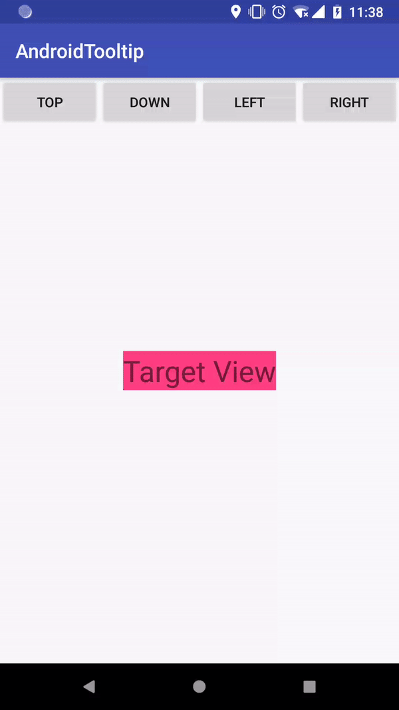

# AndroidTooltip
A easy use and powerful tooltip
## Preview


## Simple Example
```
Tooltip.Builder builder = new Tooltip.Builder();
Tooltop tooltip = builder.target(targetView)
        .toolTipView(R.layout.hint)
        .position(Tooltip.Position.ABOVE)
        .build();
tooltip.show();
```
Step 1: set target view
```
builder.target(targetView)
```
Step 2: set tooltip view, it can be a view object or view in xml.
```
builder.toolTipView(hintView) // view object
or
builder.toolTipView(R.layout.hint) // view xml
```
Step 3: customize position
```
builder.position(Tooltip.Position.ABOVE); // Position
builder.align(Tooltip.Align.RIGHT); // Align
builder.offset(xOffset, yOffset); // Offset
```
Step 4: interaction
```
builder.consumeTouchEvent(inSide, outSide); // whether consume touch event when touch Tooltip View
builder.closeWhenTouch(inSide, outSide); // whether close Tooltip View when touch it.
```
